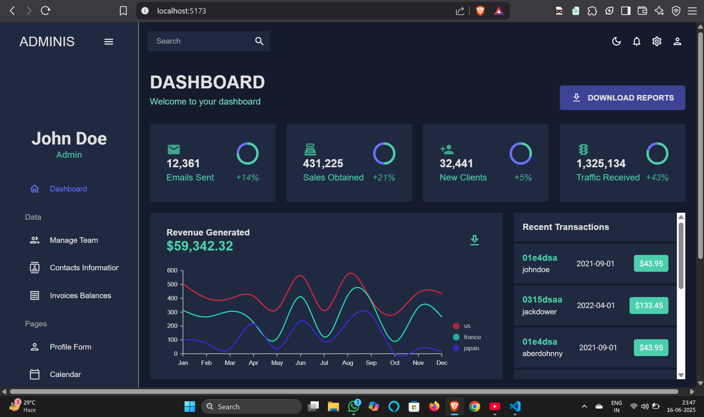
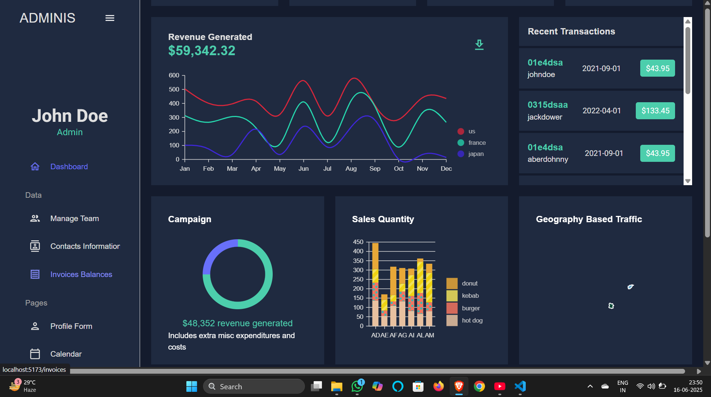
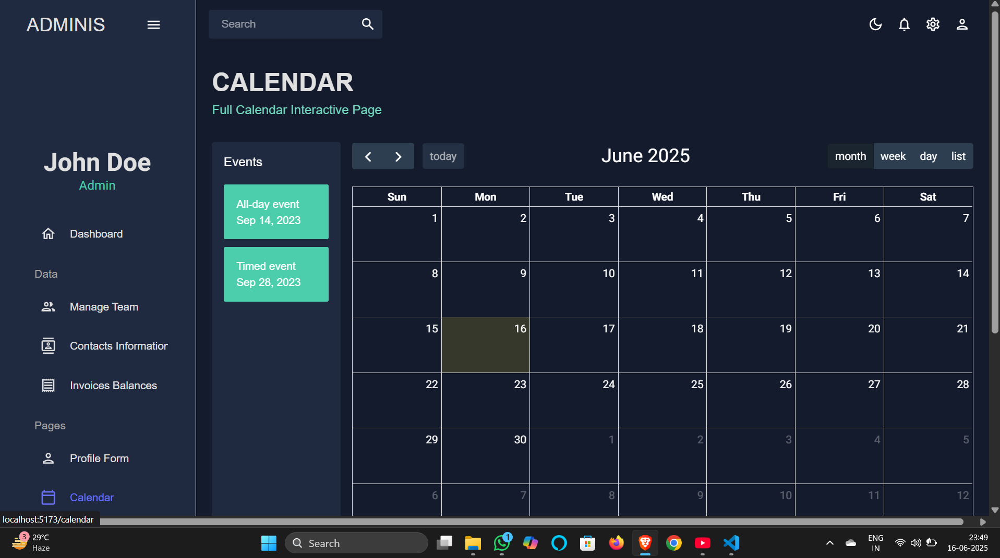

# React Admin Dashboard

A modern, responsive admin dashboard built with React, Vite, Material-UI, and various charting libraries. This project demonstrates a professional dashboard UI with charts, statistics, and navigation.

## Features
- Responsive dashboard layout
- Sidebar navigation
- Topbar with theme switcher
- Multiple chart types (Line, Bar, Pie, Geography)
- Stat cards and recent transactions
- Theming with Material-UI

## Getting Started

### Installation
1. Clone the repository:
   ```sh
   git clone <your-repo-url>
   ```
2. Navigate to the project directory:
   ```sh
   cd react-admin-dashboard
   ```
3. Install dependencies:
   ```sh
   npm install
   ```

### Running the App
```sh
npm run dev
```
The app will be available at `http://localhost:5173` by default.

## Folder Structure
- `src/` - Main source code (components, scenes, theme, data)
- `public/` - Static assets and screenshots

## Screenshots

### Dashboard Overview


### Graphs & Charts


### Calender


> Place your screenshots in the `public` folder with the above filenames for them to appear here.

## License
MIT
