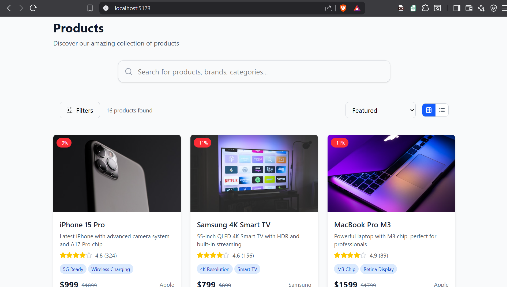
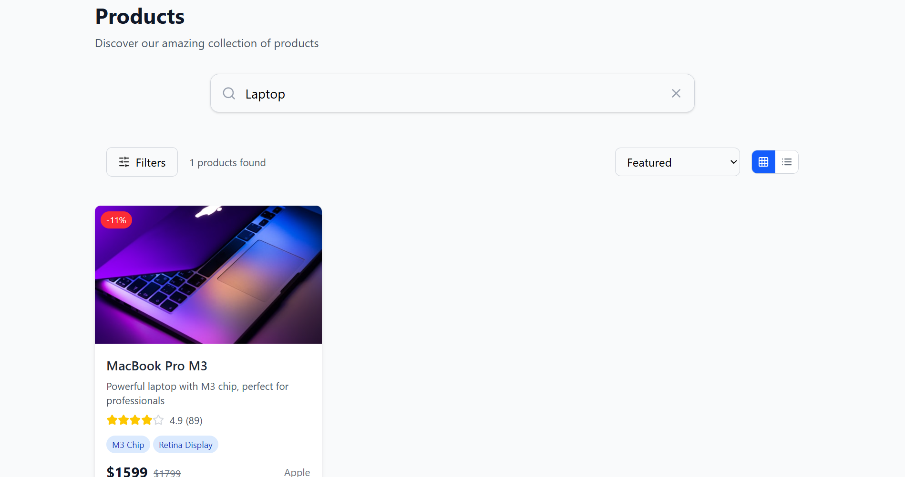
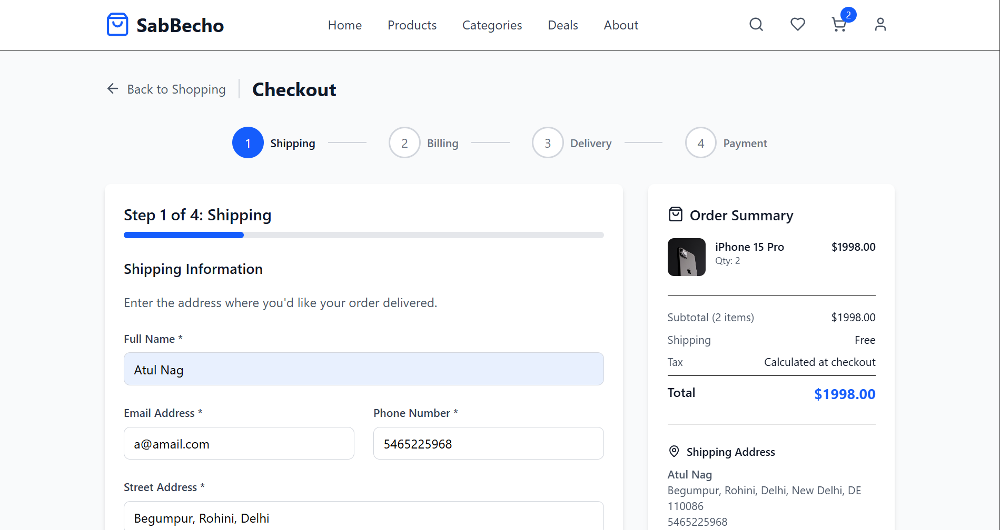
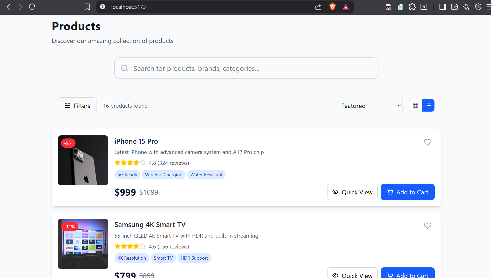

# � Sab Becho - Modern E-commerce Store

<div align="center">
  
  
  <p align="center">
    <strong>A full-featured, responsive e-commerce store built with React, Vite, and Tailwind CSS  <p>Made with ❤️ using React, Vite, and Tailwind CSS</p>
  <p>⭐ Star this repository if you found it helpful!</p>strong>
  </p>
  
  <p align="center">
    
    
    
    
  </p>
</div>

---

## 📋 Table of Contents

- [🌟 Features](#-features)
- [🎯 Core Functionality](#-core-functionality)
- [🛒 Shopping Experience](#-shopping-experience)
- [💳 Checkout & Payments](#-checkout--payments)
- [📱 Screenshots](#-screenshots)
- [🚀 Quick Start](#-quick-start)
- [🎨 Design System](#-design-system)
- [🏗️ Project Structure](#️-project-structure)
- [🔮 Upcoming Features](#-upcoming-features)
- [🤝 Contributing](#-contributing)

---

## 🌟 Features

### �️ **Complete E-commerce Experience**
- **Product Catalog**: Browse 50+ premium products across multiple categories
- **Advanced Search**: Real-time search with autocomplete and suggestions
- **Smart Filtering**: Filter by brand, price range, category, and rating
- **Flexible Sorting**: Sort by price, popularity, rating, and newest arrivals
- **Product Details**: High-quality images, specifications, and customer reviews

### 🛒 **Shopping Cart Management**
- **Persistent Cart**: Survives page refreshes and browser sessions
- **Quantity Control**: Easily adjust item quantities with visual feedback
- **Coupon System**: Apply discount codes for savings (WELCOME10, SAVE20, FREESHIP)
- **Real-time Totals**: Live updates of subtotal, shipping, tax, and final total
- **Quick Actions**: Add to cart from product listings or detail pages

### 🎯 **User Experience**
- **Responsive Design**: Perfect on desktop, tablet, and mobile devices
- **Fast Performance**: Optimized with Vite for lightning-fast load times
- **Intuitive Navigation**: Clean, modern interface with smooth transitions
- **Accessibility**: Keyboard navigation and screen reader support
- **Visual Feedback**: Loading states, hover effects, and micro-interactions

---

## 🎯 Core Functionality

### 🔍 **Product Discovery**

<div align="center">
  
  <p><em>Advanced search with autocomplete and filtering</em></p>
</div>

- **Smart Search Bar**: Autocomplete suggestions with recent searches
- **Advanced Filters**: Brand, price range, category, and rating filters
- **Multiple View Modes**: Switch between grid and list views
- **Sort Options**: Price (low to high/high to low), popularity, rating, newest

### 📦 **Product Catalog**
- **50+ Premium Products**: Electronics, clothing, home & garden, sports
- **High-Quality Images**: Multiple product images with zoom functionality
- **Detailed Information**: Specifications, features, and customer reviews
- **Stock Management**: Real-time inventory tracking
- **Related Products**: Smart product recommendations

---

## 🛒 Shopping Experience

### 🛍️ **Cart Management**
- **Persistent Storage**: Cart data saved in localStorage
- **Quantity Controls**: Increment/decrement with validation
- **Item Removal**: Easy removal with confirmation
- **Coupon System**: Multiple discount codes available
- **Free Shipping**: Automatic free shipping over $50

### 💰 **Pricing & Discounts**
```
Available Coupons:
• WELCOME10 - 10% off your first order
• SAVE20    - $20 off orders over $100  
• FREESHIP  - Free shipping on any order
```

---

## 💳 Checkout & Payments

### � **Current Status: Mock Implementation**

<div align="center">
  
  <p><em>Multi-step checkout with payment simulation</em></p>
</div>

**✅ Currently Implemented:**
- **Multi-step Checkout**: Shipping → Billing → Payment → Confirmation
- **Form Validation**: Real-time validation with error handling
- **Payment Simulation**: Mock payment processing with 90% success rate
- **Multiple Methods**: Credit/Debit cards, PayPal, and UPI options
- **Order Management**: Order confirmation with tracking numbers
- **Receipt Generation**: Detailed order receipts with download option

**🔮 Payment Integration (Upcoming):**
- Real Stripe/PayPal/Razorpay integration
- Secure payment processing with SSL
- PCI compliance for card transactions
- Live transaction processing
- Payment webhooks and confirmations

### 📋 **Checkout Flow**
1. **Shipping Information**: Name, email, phone, complete address
2. **Billing Address**: Option to use same as shipping or different
3. **Delivery Options**: Standard, Express, or Overnight shipping
4. **Payment Method**: Secure payment form with card validation
5. **Order Confirmation**: Detailed summary with tracking information

---

## 📱 Screenshots

### 🏠 **Product Listings**

<div align="center">
  
  
  <p><em>Grid view and List view options for product browsing</em></p>
</div>

### 🔍 **Search & Filtering**

<div align="center">
  
  <p><em>Advanced search with real-time filtering and sorting</em></p>
</div>

### 💳 **Checkout Process**

<div align="center">
  
  <p><em>Streamlined multi-step checkout process</em></p>
</div>

---

## 🚀 Quick Start

### Prerequisites
- Node.js (v16 or higher)
- npm or yarn package manager

### Installation

```bash
# Clone the repository
git clone https://github.com/your-username/sab-becho.git

# Navigate to project directory
cd sab-becho

# Install dependencies
npm install

# Start development server
npm run dev

# Open your browser and visit
http://localhost:5173
```

### Build for Production

```bash
# Create production build
npm run build

# Preview production build
npm run preview
```

---

## 🎨 Design System

### 🎨 **Color Palette**
```css
Primary:   #2563EB (Blue)
Success:   #10B981 (Green)
Warning:   #F59E0B (Yellow)
Error:     #EF4444 (Red)
Neutral:   #6B7280 (Gray)
```

### 🔤 **Typography**
- **Font Family**: Inter (Clean, modern sans-serif)
- **Headings**: Bold weights for strong hierarchy
- **Body Text**: Regular weight for optimal readability
- **UI Elements**: Medium weight for better contrast

### 📐 **Layout**
- **Grid System**: CSS Grid and Flexbox for responsive layouts
- **Spacing**: Consistent 8px spacing scale
- **Breakpoints**: Mobile-first responsive design
- **Container**: Max-width containers with proper margins

---

## 🏗️ Project Structure

```
sab-becho/
├── public/                    # Static assets and images
│   ├── checkout.png          # Checkout process screenshot
│   ├── grid_view.png         # Product grid view
│   ├── list-view.png         # Product list view
│   └── search.png            # Search interface
├── src/
│   ├── components/           # Reusable React components
│   │   ├── checkout/         # Checkout-specific components
│   │   ├── ProductCard.jsx   # Product display component
│   │   ├── ProductListing.jsx # Product catalog
│   │   ├── SearchBar.jsx     # Search functionality
│   │   ├── FilterSidebar.jsx # Product filtering
│   │   └── Cart.jsx          # Shopping cart
│   ├── context/              # React Context providers
│   │   ├── CartContext.jsx   # Cart state management
│   │   └── CheckoutContext.jsx # Checkout flow
│   ├── data/                 # Mock data and constants
│   │   └── products.js       # Product catalog data
│   ├── pages/                # Page components
│   └── App.jsx               # Main application component
├── package.json              # Dependencies and scripts
├── tailwind.config.js        # Tailwind CSS configuration
└── vite.config.js           # Vite build configuration
```

---

## 🔮 Upcoming Features

### 🔒 **Authentication & User Management**
- [ ] User registration and login
- [ ] User profiles and preferences
- [ ] Order history and tracking
- [ ] Wishlist functionality
- [ ] Social media authentication

### 💳 **Real Payment Integration**
- [ ] Stripe payment gateway
- [ ] PayPal integration
- [ ] Razorpay for Indian market
- [ ] Cryptocurrency payments
- [ ] Buy now, pay later options

### 📱 **Enhanced Mobile Experience**
- [ ] Progressive Web App (PWA)
- [ ] Push notifications
- [ ] Offline functionality
- [ ] Touch gestures and swipe actions

### 🤖 **Advanced Features**
- [ ] AI-powered product recommendations
- [ ] Voice search capability
- [ ] Live chat support
- [ ] Product comparison tool
- [ ] Inventory management dashboard

### 🌐 **Backend Integration**
- [ ] REST API development
- [ ] Database integration (MongoDB/PostgreSQL)
- [ ] Real-time inventory updates
- [ ] Admin dashboard
- [ ] Analytics and reporting

### 🎯 **Business Features**
- [ ] Multi-vendor marketplace
- [ ] Subscription products
- [ ] Digital product downloads
- [ ] Affiliate program
- [ ] Customer reviews and ratings system

---

## 📊 Performance Metrics

- âš¡ **Fast Loading**: < 2s initial page load
- 📱 **Mobile Optimized**: 95+ Lighthouse mobile score
- ♿ **Accessible**: WCAG 2.1 AA compliance
- 🔍 **SEO Ready**: Meta tags and structured data
- 🚀 **Modern Tech**: Latest React 18 features

---

## 🤝 Contributing

We welcome contributions! Please follow these steps:

1. Fork the repository
2. Create a feature branch (`git checkout -b feature/amazing-feature`)
3. Commit your changes (`git commit -m 'Add amazing feature'`)
4. Push to the branch (`git push origin feature/amazing-feature`)
5. Open a Pull Request

### Development Guidelines
- Follow ESLint and Prettier configurations
- Write meaningful commit messages
- Test your changes thoroughly
- Update documentation as needed

---

## 📄 License

This project is licensed under the MIT License - see the [LICENSE](LICENSE) file for details.

---

## 👨‍💻 Developer

**Atul Kumar**
- 🌐 Portfolio: [your-portfolio.com](https://your-portfolio.com)
- 💼 LinkedIn: [linkedin.com/in/your-profile](https://linkedin.com/in/your-profile)
- 📧 Email: your.email@example.com

---

<div align="center">
  <p>Made with ❤️ using React, Vite, and Tailwind CSS</p>
  <p>⭐ Star this repository if you found it helpful!</p>
</div>
