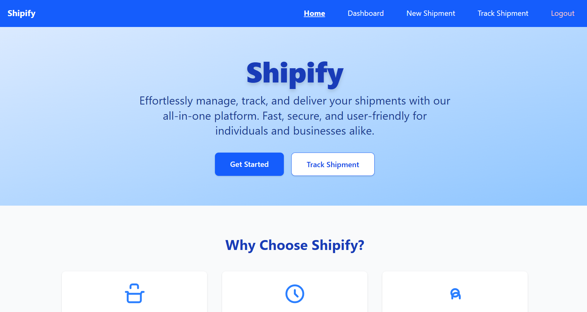
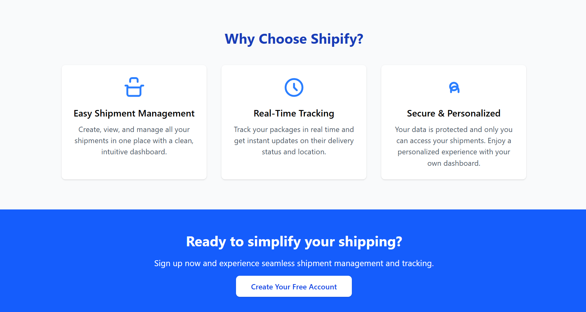
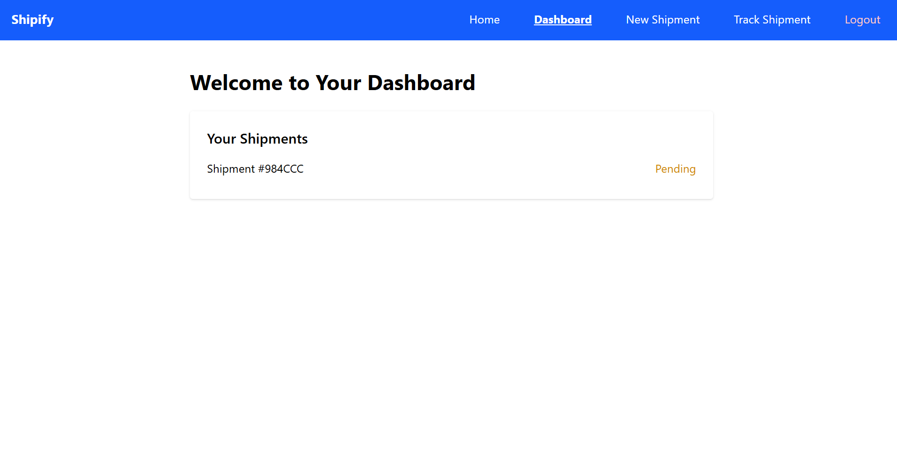

# Shipify - Shipment Delivery Application



## Overview
Shipify is a full-stack shipment delivery application that enables users to manage shipments and track their delivery status. It features user registration, login, personalized dashboards, shipment creation, and real-time tracking—all with a modern, responsive UI.

## Features
- **User Registration & Login**: Secure authentication with JWT.
- **Dashboard**: View all your shipments and their statuses at a glance.
- **New Shipment**: Initiate new shipments by providing sender, receiver, package size, and delivery address.
- **Track Shipment**: Monitor the status and details of your shipments in real time.
- **Responsive UI/UX**: Beautiful, mobile-friendly design using Tailwind CSS.
- **MongoDB Atlas Integration**: Cloud database for scalable storage.



## Tech Stack
- **Frontend**: React, Vite, Tailwind CSS
- **Backend**: Node.js, Express, MongoDB (Atlas), JWT, Mongoose

## Getting Started

### Prerequisites
- Node.js & npm
- MongoDB Atlas account (or local MongoDB)

### Setup
1. **Clone the repository**
2. **Install dependencies**
   - Frontend: `cd shipify/frontend && npm install`
   - Backend: `cd shipify/backend && npm install`
3. **Configure environment variables**
   - In `shipify/backend/.env`:
     ```
     PORT=5000
     MONGO_URI=your_mongodb_atlas_uri
     JWT_SECRET=your_jwt_secret
     ```
4. **Start the backend**
   - `cd shipify/backend && npm start` (or `npx nodemon index.js`)
5. **Start the frontend**
   - `cd shipify/frontend && npm run dev`
6. **Open the app**
   - Visit [http://localhost:5173](http://localhost:5173) in your browser.

## Screenshots

### Home Page


### Dashboard


### Features


## License
MIT 